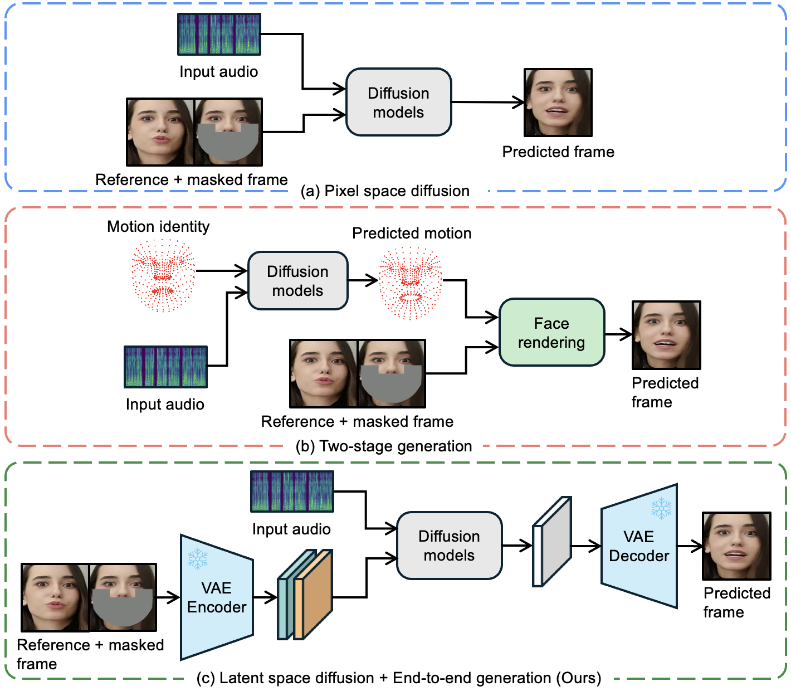

# LatentSync: Audio Conditioned Latent Diffusion Models for Lip Sync

  <a href="https://arxiv.org/abs/2412.04431">Paper</a>

## 📖 Introduction

We present LatentSync, an end-to-end lip sync framework based on audio conditioned latent diffusion models without any intermediate motion representation, diverging from previous diffusion-based lip sync methods based on pixel space diffusion or two-stage generation. Our framework can leverage the powerful capabilities of Stable Diffusion to directly model complex audio-visual correlations.

## Demo

<table class="center">
  <tr style="font-weight: bolder;text-align:center;">
        <td width="50%"><b>Original video</b></td>
        <td width="50%"><b>Lip-synced video</b></td>
  </tr>
  <tr>
    <td>
      <video src=https://github.com/user-attachments/assets/89b02797-457c-4510-8dfb-8d10ffac76d2 controls preload></video>
    </td>
    <td>
      <video src=https://github.com/user-attachments/assets/5c4cf5e3-a52b-453a-a977-615043fd681c controls preload></video>
    </td>
  </tr>
  <tr>
    <td>
      <video src=https://github.com/user-attachments/assets/78cd1df3-c15b-492f-bc4a-b88615266d73 controls preload></video>
    </td>
    <td>
      <video src=https://github.com/user-attachments/assets/c7781efa-1179-4fed-9193-791af9990af2 controls preload></video>
    </td>
  </tr>
  <tr>
    <td>
      <video src=https://github.com/user-attachments/assets/b7da5495-a02b-4efe-86bf-df56246725f0 controls preload></video>
    </td>
    <td>
      <video src=https://github.com/user-attachments/assets/99fcf7e7-2db7-488b-93de-c6ed78203a6d controls preload></video>
    </td>
  </tr>
  <tr>
    <td width=150px>
      <video src=https://github.com/user-attachments/assets/d08287ad-48c1-4bc3-8c8f-a333cf57f5fa controls preload></video>
    </td>
    <td>
      <video src=https://github.com/user-attachments/assets/872525ef-bac4-44d1-9ecf-d51928b3aaf5 controls preload></video>
    </td>
  </tr>
</table>

## 📑 Open-Source Plan

- [ ] Inference code and checkpoints
- [ ] Data processing pipeline
- [ ] Training code
